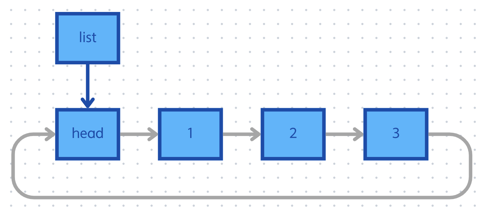

## 단순 연결 리스트의 문제점
- [단순 연결 리스트](./2024-09-10-Linked_list.md)의 문제점은 리스트의 맨 끝이 `NULL` 이라는 것이다.
- 리스트를 순회할 때, 실수로 `NULL` 을 참조하는 상황이 발생할 수 있다.
- 이를 해결하기 위해 꼬리(tail) 노드를 추가할 수 있지만, 이는 단순히 `NULL` 이 꼬리 노드가 된 것에 불과하다.
- 즉, 여전히 `NULL` 을 참조하는 상황이 발생한다.

<p align="center">
    
</p>

- 여기에서 꼬리 노드가 헤드 노드가 되도록 해서 `NULL` 참조를 해결할 수 있다.
- 무한 반복에 빠질 가능성이 있지만, 프로그램이 `NULL` 참조로 인해 강제 종료된다는 면에서는 훨씬 좋은 방식이다.
- 이러한 방식이 바로 원형 연결 리스트이다.

<p align="center">
    
</p>

## 화면에 출력
- 원형 연결 리스트라고 해서, 연결 리스트의 원리가 완전히 달라지는 것이 아니다.
- 기존의 삽입과 삭제를 그대로 유지한 상태에서, 초기화 방식과 `display` 와 같이 순환하는 함수만 변경하면 된다.

```c
list_t head = { 0, &head };	// 초기화

...

void display(const list_t head)
{
	node_t* curr = head.next;
	system("cls");
	printf("HEAD->");
	while (curr != head)
	{
		printf("[%d]->", curr->data);
		curr = curr->next;
	}
	puts("HEAD");
	getchar();
}
```

## 참고한 자료
- [이것이 자료구조+알고리즘이다 with C언어](https://www.yes24.com/Product/Goods/111362116)
- [오픈소스 자료구조 및 알고리즘 in C](https://www.inflearn.com/course/%EC%98%A4%ED%94%88%EC%86%8C%EC%8A%A4-%EC%9E%90%EB%A3%8C%EA%B5%AC%EC%A1%B0-%EC%95%8C%EA%B3%A0%EB%A6%AC%EC%A6%98-c/dashboard)