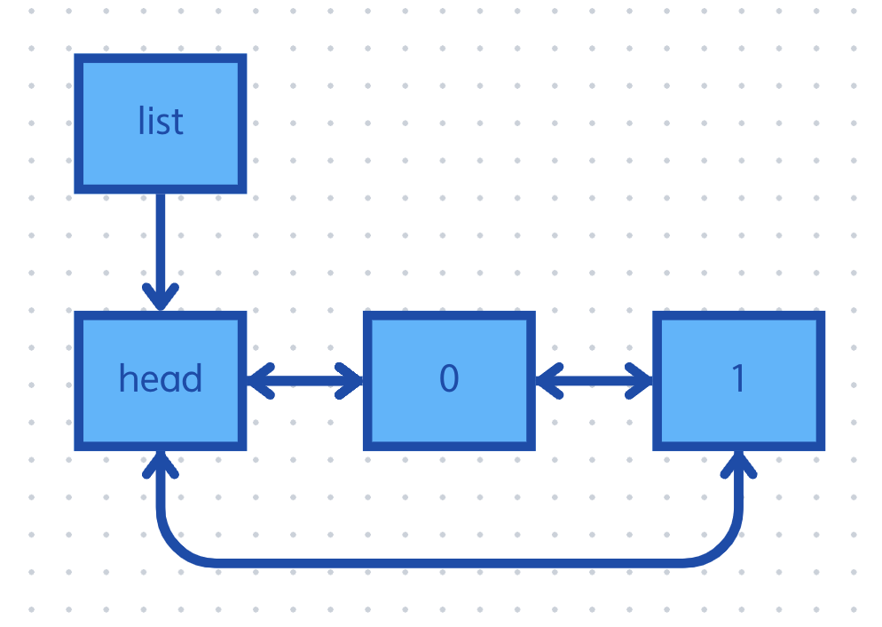

## 원형 연결 리스트의 문제점
- 지금까지 구현한 [원형 연결 리스트](./2024-09-11-Circular_list.md)의 문제점은 정방향 연결 리스트라는 것이다.
- `display` 같은 순환에서 오직 한 방향만으로만 순환할 수 있다는 의미이다.
- 이러한 상황에서 검색을 하려고 한다면, 정방향 탐색만 가능하다.
- 만일 역방향 탐색이 되도록 하려면, 리스트 자체를 역으로 뒤집어 탐색하는 것이 더 간편하다.

```c
void reverse(list_t* const head)
{
	node_t* prev = head;
	node_t* curr = head->next;
	node_t* next = curr->next;

	while (curr != head)
	{
		curr->next = prev;
		prev->next = curr;
		curr->next = next;
		next->next = next;
	}
	head->next = prev;
}
```

- 하지만, 이 역시 리스트의 크기가 크면 연산을 한 번 하는데 많은 시간이 든다는 문제점이 있다.

## 이중 연결 리스트
- 이를 해결하기 위해 양방향 탐색이 가능하도록하는 리스트가 이중 연결 리스트이다.

<p align="center">
    
</p>

- 이중 연결 리스트는 이전까지의 리스트와 달리, 이전 노드를 가리키는 포인터 하나를 추가로 가지는 구조이다.
- 이렇게 함으로써, 이전 노드를 접근해 역방향으로도 순환할 수 있다.

```c
typedef struct s_node
{
	int data;
	struct s_node* prev;
	struct s_node* next;
}node_t;

typedef node_t list_t;
```

## 삽입
- 기존 리스트의 삽입에서 이전 노드에 대한 포인터만 추가해 주면 된다.
	1. 삽입할 데이터를 가지고 있는 노드를 하나 생성한다.
	2. 생성한 노드의 이전 노드가 `head` 가 되도록 한다.
	3. 생성한 노드의 다음 노드가 `head` 가 가리키던 다음 노드가 되도록 한다.
	4. `head` 의 이전 노드가 생성한 노드 혹은 리스트의 맨 마지막이 되도록 한다.
	5. `head` 의 다음 노드가 생성한 노드가 되도록 한다.

<p align="center">
    
</p>

```c
void insert_data(list_t* head, const int data)
{
	node_t* new_node = (node_t*)malloc(sizeof(node_t));
	if (!new_node)	return;

	new_node->data = data;
	new_node->prev = head;
	new_node->next = head->next;
	new_node->next->prev = new_node;	// 4번을 간편하게 변경경
	head->next = new_node;
}
```

- 보다 싶이 코드 자체가 복잡하다.
- 따라서 삽입 내용을 일반화 시켜서 좀 더 가독성이 좋게 할 수 있다.

```c
void __insert_data(list_t* prev, list_t* curr, list_t* next)
{
	curr->prev = prev;
	curr->next = next;
	next->prev = curr;
	prev->next = curr;
}

void insert_data(list_t* head, const int data)
{
	node_t* new_node = (node_t*)malloc(sizeof(node_t));
	if (new_node)	return;
	new_node->data = data;
	insert_data(head, new_node, head->next);
}
```

## 삭제
- 삭제 역시 기존 리스트의 삭제에서 이전 노드에 대한 포인터만 추가해주면 된다.
	1. 삭제할 노드의 이전 노드가 가리키는 다음 노드가, 삭제할 노드의 다음 노드가 되도록 한다.
	2. 삭제할 노드의 다음 노드가 가리키는 이전 노드가, 삭제할 노드의 이전 노드가 되도록 한다.

<p align="center">
    
</p>

```c
void remove_data(list_t* head)
{
	if (!head || head->next == head)	return;

	node_t* to_del = head->next;
	to_del->prev->next = to_del->next;
	to_del->next->prev = to_del->prev;
	free(to_del);
}
```

- 이 역시, `__insert` 와 같이 추상화된 함수를 사용할 수 있다.

```c
void __remove(node_t* prev, node_t* curr, node_t* next)
{
	prev->next = next;
	next->prev = prev;
	free(curr);
}

void remove_data(list_t* head)
{
	if (!head || head->next == head)	return;
	__remove(head, head->next, head->next->next);
}
```

## 참고한 자료
- [이것이 자료구조+알고리즘이다 with C언어](https://www.yes24.com/Product/Goods/111362116)
- [오픈소스 자료구조 및 알고리즘 in C](https://www.inflearn.com/course/%EC%98%A4%ED%94%88%EC%86%8C%EC%8A%A4-%EC%9E%90%EB%A3%8C%EA%B5%AC%EC%A1%B0-%EC%95%8C%EA%B3%A0%EB%A6%AC%EC%A6%98-c/dashboard)