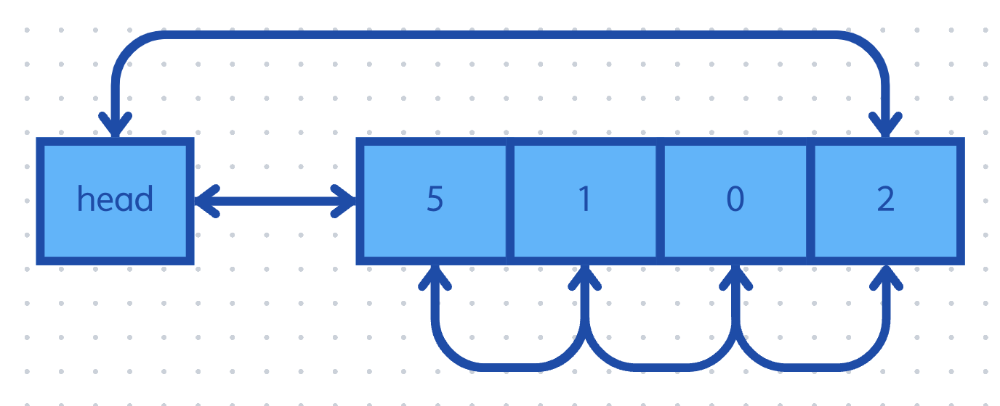

## 이전까지 구현한 리스트의 문제
- [단순 연결 리스트](./2024-09-10-Linked_list.md)부터 [이중 연결 리스트](./2024-09-11-Double-list.md)까지 구현했을 때, 공통적인 문제점은 `malloc` 을 통해 메모리를 할당한다는 것이다.
- `malloc` 은 아주 복잡한 알고리즘으로 동작하기 때문에, 어느 환경에서 `malloc` 을 자주 사용하는 것이 오버헤드를 많이 차지하는 것일 수 있다.
- 이 문제를 해결하기 위해 메모리 풀이라는 기법을 사용한다.

<p align="center">
    
</p>

- 겉으로 보기에는 배열과 다를게 없어 보이지만, 커널과 같이 요소의 개수가 한정적인 환경에서 많이 사용한다.
- 시스템 리소스의 개수가 정해져 있기 때문에, 굳이 데이터 하나를 생성할 때마다 메모리를 할당하지 않아도 된다.
- 이렇게 하면 실행 중에 `malloc` 을 사용하는 횟수가 적어지므로, 더 빠르게 실행할 수 있다.

## 구현
- 실제 구현은 기존의 코드에서 크게 변경되는 점은 없다.
- 메모리 풀 기법을 사용하기 때문에, 스택에서든 힙에서든 할당을 하고 나서 해당 풀을 넘겨 주는 방식을 사용해야 한다.

```c
list_t head = { 0, &head, &head };
list_t list[10] = { 0, };
```

- `insert_data` 의 경우, 새로운 노드를 만드는 대신 만들어진 노드를 넘겨주는 방식을 취해야 한다.
- 단, 기존에 만들었던 `__insert` 는 일반화 한 것이기 때문에 그대로 유지해줘도 된다.

```c
void insert_data(list_t* head, node_t* const node)
{
    __insert(head, node, head->next);
}
```

- `remove_data` 의 경우, `free` 하는 로직을 없애야 한다.

```c
void remove_data(list_t* const head)
{
	if (!head || head->next == head)	return;
	__remove(head, head->next, head->next->next);
}

static void __remove(node_t* prev, node_t* curr, node_t* next)
{
	prev->next = next;
	next->prev = prev;
}
```

## 참고한 자료
- [오픈소스 자료구조 및 알고리즘 in C](https://www.inflearn.com/course/%EC%98%A4%ED%94%88%EC%86%8C%EC%8A%A4-%EC%9E%90%EB%A3%8C%EA%B5%AC%EC%A1%B0-%EC%95%8C%EA%B3%A0%EB%A6%AC%EC%A6%98-c/dashboard)