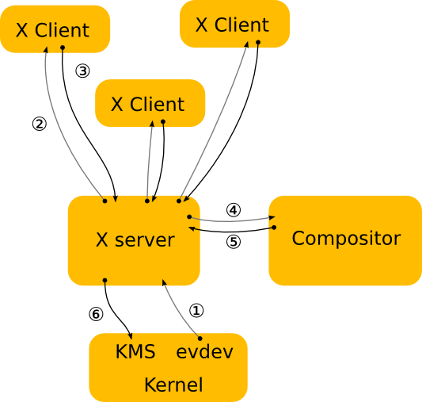
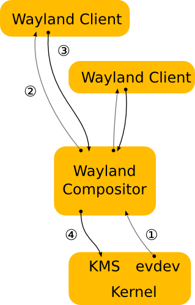

## 문제점 파악
- Rocky Linux에서 Discord를 설치한 뒤, 음성채널에서 화면공유를 시도하면 화면공유가 되지 않는 현상이 발생한다.
- 아래와 같은 방법으로 디스플레이가 사용하고 있는 서버를 확인하면, `wayland`가 나온다.

```shell
$ echo $XDG_SESSION_TYPE
```

- 이는 현재 시스템이 디스플레이 출력을 위해 사용하는 서버가 Wayland라는 의미이다.
- Discord의 화면공유 기능이 X11 기반으로 되어 있는데, 실제 리눅스가 사용하는 서버는 Wayland로 되어 있어서 발생하는 문제이다.

## X11
- X window system 이라고도 하며, 유닉스 계열의 환경에서 윈도우 GUI 환경을 제공해 주는 시스템 프로그램이다.
- 서버-클라이언트 모델을 기반으로 동작한다.
    - X11 클라이언트는 화면에 실행되고 있는 애플리케이션들이다.
    - X11 서버는 커널과 X11 클라이언트의 징검다리 역할을 한다.

## X11의 구조

- 전체적인 동작 원리는 다음과 같다.
<br>
1. 입력 장치로부터 이벤트가 발생하면 커널이 받아서 evdev를 통해 X11 서버로 전송한다.
2. X11 서버는 받은 이벤트가 어느 위치에서 발생했는지 확인하다.
3. 이벤트의 위치가 확인되면, 해당 위치의 클라이언트에게 이벤트를 전달한다.
4. 클라이언트는 이벤트에 대한 처리가 이루어지고, 응답과 동시에 렌더링 요청을 보낸다.
5. X11 서버가 렌더링 요청을 받으면, 다시 컴포지터에게 렌더링 요청을 보내어 실제 렌더링이 이루어 진다.
6. 렌더링된 이미지를 커널로 전송해 화면에 출력한다.
<br>
- 여기서 중요한 것은 X11이 컴포지터를 반드시 거쳐야 한다는 것이다.
    - 컴포지터는 화면에 그릴 이미지를 최종적으로 렌더링하는 프로그램이다.
    - X11은 직접 화면을 그리지 않고 컴포지터에게 맡기는 구조이기 때문에, 성능적으로 떨어진다.
- 그리고 X11의 구조는 중앙 서버에 집중되어 있을 뿐만 아니라, 어떠한 클라이언트든 접근할 수 있는 구조이기 때문에 보안적으로 취약하다.

## Wayland

- Wayland 역시 X11과 동일한 기능을 가진 프로그램이다.
- 단, 구조에서 차이가 난다.
- X11 서버 구조에서 달라진 것은 컴포지터가 직접 이벤트를 받고 렌더링 요청을 받는 구조이기 때문에 성능적으로 X11보다 빠르다.
- 그리고 보안적으로도 강점이 있는데, 여기에서는 Wayland는 권한에 대한 제한을 통해 각 요청과 응답에 대해서 보안적으로 관리하기 때문이다.
- 하지만, 그렇다고 해서 강점만 있지는 않다.
- Wayland는 이론적으로는 장점이 크지만, 실제 구현에 있어서는 X11보다 버그가 많아 불안정하다.
- 그리고 아직까지도 Discord처럼 X11만 지원하는 프로그램이 많기 때문에 호환성 문제가 있다.

## 해결책
- GDM을 설정해주는 파일을 수정해주기만 하면 된다.

```shell
sudo vi /etc/gdm/custom.conf
```

- 설정 파일의 Deamon 섹션에 다음과 같이 작성한다.

```
WaylandEnable=false
```

- 이렇게 하면, GDM이 기본으로 설정되어 있는 X11을 사용하게 된다.
- 재부팅을 해서 화면 공유를 시도하면, 정상적으로 동작하는 것을 확인할 수 있다.

## 참고한 자료
[X11](https://ko.wikipedia.org/wiki/X_%EC%9C%88%EB%8F%84_%EC%8B%9C%EC%8A%A4%ED%85%9C)
[Wayland](https://wayland.freedesktop.org/architecture.html)
[X11 vs Wayland](https://www.linux.org/threads/advantages-of-wayland-over-x11.49441/)