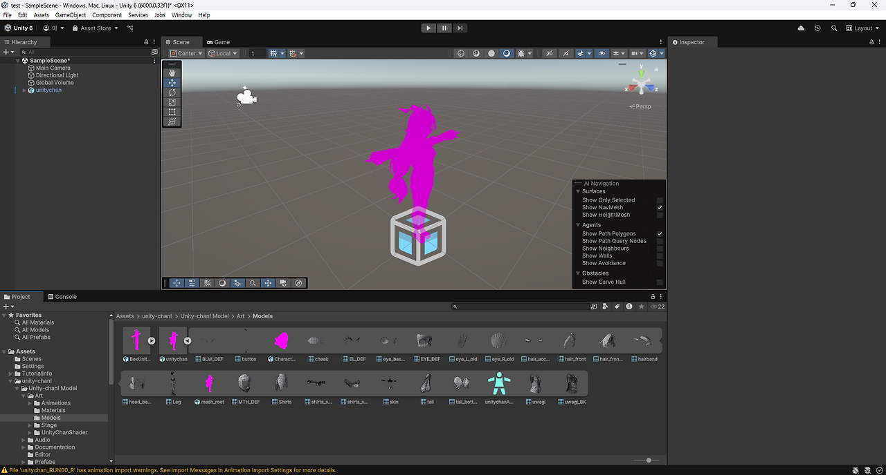
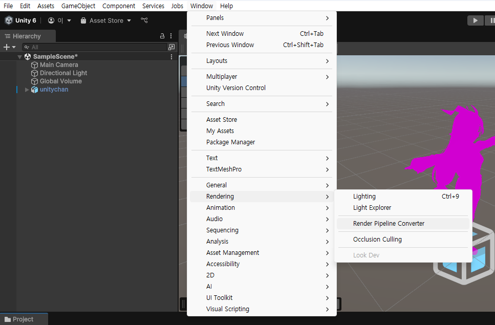
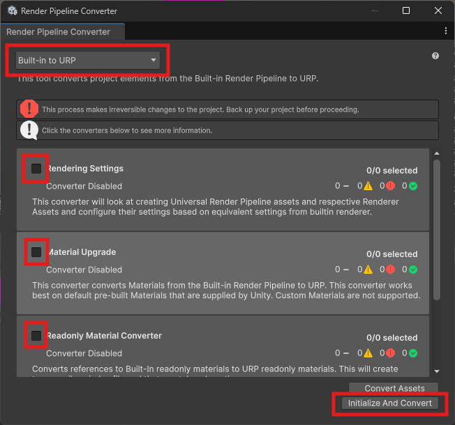
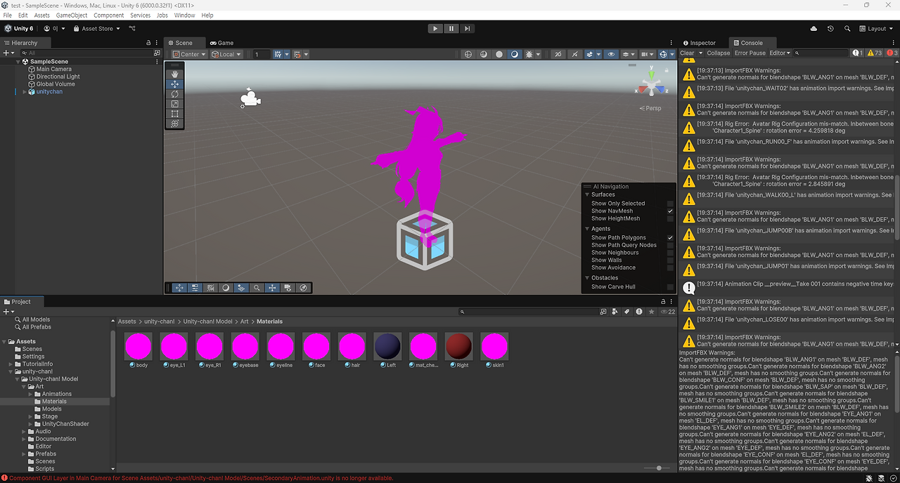
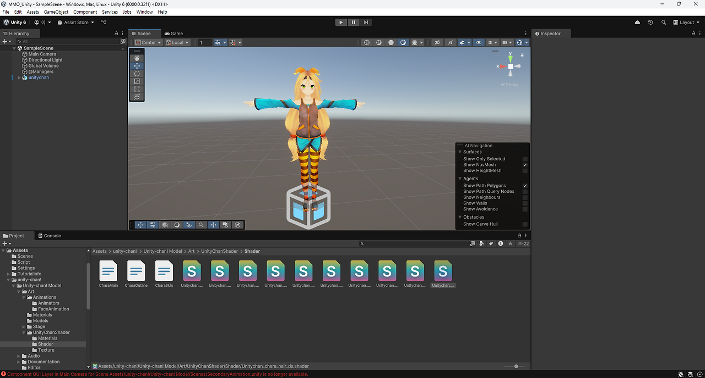

## 상황
- Unity 6000.0.32f1 버전에서 Unity-chan 에셋을 import를 한 상황이다.
- 여기에서 Unity-chan 에셋의 3D 모델을 가져오면 마젠타색으로 덮혀져 있다.
- 이러한 문제는 쉐이더는 호환되지 않아 발생하는 문제이다.
<p align="center">
    
</p>

## 해결 과정 1
- `Window - Rendering - Rendering Pipeline Converter` 를 실행한다.

<p align="center">
    
</p>

- Built-in to URP로 설정하고 모든 항목을 선택한다.
- Initialize and Convert를 실행한다.

<p align="center">
    
</p>

- 그러나 몇몇 Material만 수정되고 거의 대부분은 여전히 그대로이다.

<p align="center">
    
</p>

## 해결 과정 2
- 문제가 발생한 Material의 Shader를 `Universal Render Pipeline/Nature/SpeedTree7` 으로 변경해 보았다.
- 홍조나 눈동자 같은 것들은 `Universal Render Pipeline/Nature/SpeedTree8` 으로 변경해 보았다.
- 놀랍게도 외형적으로는 정상적으로 돌아왔다.
- 그런데, SpeedTree는 실시간으로 나무나 식물을 현실감 있게 표현하기 위한 쉐이더이다.
- 추측하기로, SpeedTree로 동작했던 이유는 다음과 같을 것이다.
    1. SpeedTree는 Unity-chan의 쉐이더 방식과 URP 방식 모두 지원한다.
    2. Unity-chan의 쉐이더 방식을 URP 방식으로 변환한다.
- 어찌되었든, 이러한 방식은 온전한 해결방식이 아니다.

## 해결 과정 3
- Unity-chan의 shader 파일을 직접 수정해 보았다.
- Unity-chan의 shader 파일의 `Subshader Tags`섹션에 `"LightMode"="ForwardBase"`를 제거하고, `"RednererPipeLine="UnversalPipeline"`를 추가한다.
- 그리고 모든 `Subshader Pass` 섹션에 `Tags{ "LigthMode" = "UniversalForward" }`를 추가한다.
- 이렇게 하면, Unity-chan의 쉐이더 방식이 URP 방식으로 변경된다.

<p align="center">
    
</p>

## 아주 얕은 ShaderLab의 구조
- Unity의 shader 파일은 ShaderLab이라는 Unity 고유 언어로 작성되어 있다.
- Unity의 ShaderLab은 HLSL이나 CG(C for Graphic)으로 번역되어 실행된다.
- Properties
    - Material 인스펙터 창에 나오는 요소들을 정의한 섹션이다.
    - 이 값들은 Material의 데이터로 직렬화 된다.
    - 보통 인스펙터 창에 나올 이름, 타입으로 표시된다.
```ShaderLab
name("display", type)
```
- Subshader
    - 실제 그래픽 카드에서 실행될 것들을 작성하는 섹션이다.
    - `Tag` 와 `Pass` 등으로 구성되어 있다.
    - Tags
        - Subshader의 parameter를 지정한다.
        - 렌더링 엔진이 어떻게 렌더링하고 언제 렌더링 할지를 지정한다.
    - Pass
        - 실제 렌더링이 이루어지는 공간이다.
        - 보통 몇몇 옵션과 함께, CG로 작성되어 있다.