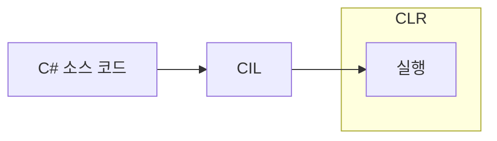
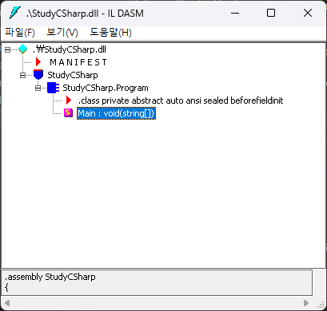
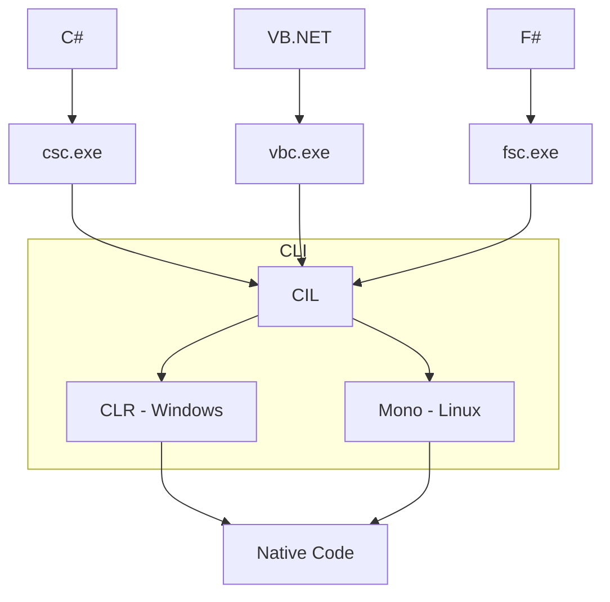

## C#이 컴파일되는 방식
- C#은 Java와 같은 JIT(Just-in-time) 컴파일러 언어이다.
- 때문에, C#은 C/C++처럼 곧바로 기계어로 변환되지 않는다.
- C#으로 작성한 소스코드를 컴파일하면 우선 중간 단계 언어 - *CIL(Common Intermediate Language)*로 바뀐다.
- 이때의 CIL은 EXE파일 혹은 DLL파일에 들어가게 된다.
- CIL은 *CLR(Common Language Runtime)*이라고 하는 가상머신에서만 실행된다.
	- CLR은 CIL을 기계어로 번역하는 것과 함께, GC(Garbage Collector) 기능역시 수행된다.
- 때문에, EXE/DLL에는 CIL과 함께 CLR 로더가 같이 포함된다.



## .NET 호환 언어
- .NET Framework는 .NET 호환 언어들을 CIL로 컴파일해서, CLR로 실행해주는 전체적인 환경 - 플랫폼을 의미한다.
- 물론, 그외에 다른 기능들 - 이를 테면 라이브러리 같은 것들도 포함되어 있다.
- .NET 호환 언어들은 공통적으로 두가지 조건을 만족해야 한다.
	1. 적어도 *CLS(Common Language Specification)* 규약에 있는 요소들을 구현해야 한다.
	2. *CTS(Common Type System)* 규약의 범위를 벗어나는 기능은 구현할 수 없다.
- 마이크로 소프트는 .NET Framework에서 구동되는 언어들이 서로 호환될 수 있도록 최대치와 최소치를 정의해 둔 것이다.

## 빌드를 하게 되면?
- "Hello, World"를 출력하는 아주 간단한 프로그램을 작성해서 빌드를 해보자.

```C#
using System;

namespace StudyCSharp
{
    static class Program
    {
        static void Main(string[] args)
        {
            Console.WriteLine("Hello, World!");
            Console.ReadLine();
        }
    }
}
```

- 이때, 빌드한 것들을 보면 EXE파일과 DLL파일이 나온다.

```PowerShell
디렉터리: C:\Users\griii\source\repos\StudyCSharp\StudyCSharp\bin\Release\net8.0

Mode                 LastWriteTime         Length Name
----                 -------------         ------ ----
-a----         4/12/2025  11:40 PM            425 StudyCSharp.deps.json
-a----         4/12/2025  11:40 PM           4608 StudyCSharp.dll
-a----         4/12/2025  11:40 PM         139264 StudyCSharp.exe
-a----         4/12/2025  11:40 PM          10512 StudyCSharp.pdb
-a----         4/12/2025  11:40 PM            340 StudyCSharp.runtimeconfig.json
```

- 여기에서 .NET 환경에서 사용하는 파일의 단위가 나온다.
- 빌드한 것들이 하나의 프로그램으로써 배포되도록 한다면, 현재 위에서 보이는 여러 개의 파일을 하나의 *어셈블리(Assembly)*라고 표현한다.
- 그리고, 이들은 실제 여러 개의 물리적 파일로 구성되어 있고 이 물리적 파일 하나하나를 *모듈(Module)*이라고 한다.
- 그런데, 이 모듈이 예시보다 훨씬 더 많을 수도 있는 상황에서는 EXE 파일이나 DLL 파일이 다른 파일에 어떻게 접근해야 하는지 모르는 경우가 발생한다.
- 이를 해결하기 위해, DLL 혹은 EXE 파일에는 추가적으로 *매니페스트(Manifest)* 데이터가 들어간다.
	- 참고로, 매니페스트가 없는 파일은 보통 확장자가 `netmodule` 이다.
	- 그리고 .NET 호환 언어로 빌드한 모든 파일은 메타데이터를 가지고 있다.

<p align="center">
    
</p>

- 이렇듯 빌드된 파일의 구조, .NET 호환 언어의 조건(CTS, CLS)등은 모두 *CLI(Common Language Infrastructuer)*라는 규약으로 정의되어 있다.

## .NET Framework
- 지금까지의 내용을 정리하면 아래의 그림과 같다.



- 여기에서의 핵심은 바로 가상머신인 CLR이다.
- .NET Framework는 핵심 요소인 CLR과 그 외 나머지 요소들이라고 봐도 무방하다.
- C#은 .NET Framework을 다루기 위해 나온 언어이며, C#을 통해서 .NET Framework를 다룰 수 있다.

<p align="center">
    
</p>

## 참고한 자료
- [시작하세요! C# 12 프로그래밍](https://www.yes24.com/product/goods/125905684)
- [.NET 문서](https://learn.microsoft.com/ko-kr/dotnet/)