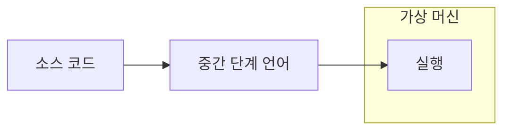
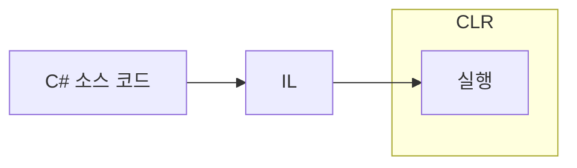
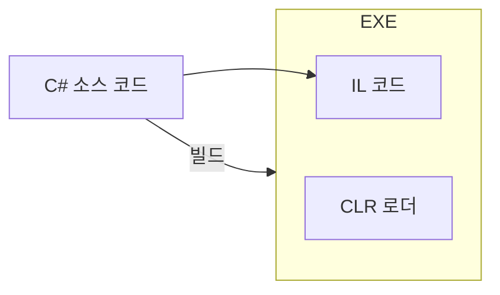

## JIT 컴파일러 언어
- C#은 Java와 유사한 구조로 되어 있는 JIT(Just-In-Time) 컴파일러 언어이다.
- 기존의 컴파일러 언어는 오프라인 컴파일러가, 인터프리터 언어는 인터프리터가 중요하다면 JIT는 가상머신이 중요하다.
- 가령, C#으로 작성한 코드는 오프라인 컴파일러가 "중간 단계 언어"로 번역한다.
- 중간 단계 언어는 바로, 가상머신에서만 동작할 수 있는 언어로 이때 부터는 인터프리터 방식(정확히는 유사한 방식)으로 실시간으로 번역된다.

- 여기에서 각 언어마다 명칭이 다르지만, 하는 역할과 구조자체는 크게 바뀌지 않는다.

## .NET Framework
- 위의 과정을 C#에 적용을 해보자.
- C#으로 작성한 소스 코드는 C# 오프라인 컴파일러로 중간 단계 언어로 컴파일 된다.
- C# 환경에서 중간 단계 언어는 *IL(Intermediate Language)*라고 한다.
- 그리고 IL은 *CLR(Common Language Runtime)*이라고 하는 가상머신에서만 실행 할 수 있다.

- 실제로, C#으로 빌드를 하게 되면 생성된 파일 내부에 IL이 추가된다.
- 하지만, IL 자체만으로는 실행 할 수 없기 때문에 IL과 함께 CLR 로더를 추가한다.
- 가령, EXE 파일을 실행하게 된다면 CLR 로더로 인해 CLR이 실행되고 CLR로 인해 IL이 실행되는 구조인 것이다.

- 이런것들이 가능한 전체 환경을 제공해주는 플렛폼이 .NET Framework이다.

## 참고한 자료
- [시작하세요! C# 12 프로그래밍](https://www.yes24.com/product/goods/125905684)
- [.NET 문서](https://learn.microsoft.com/ko-kr/dotnet/)